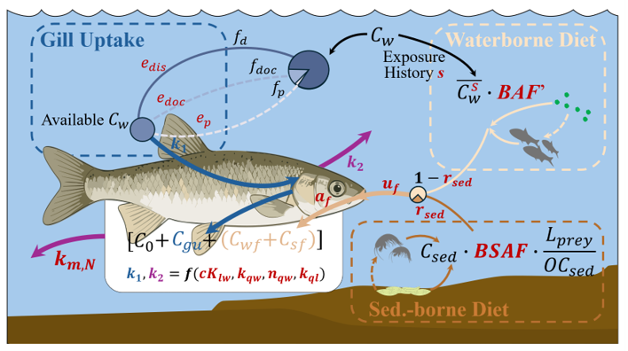

# Toxicokinetic Model for Fish PACs

## Overall

This repository contains the model code, input data, and analysis scripts for simulating Polycyclic Aromatic Compound (PAC) concentrations in fish from tributaries of the Athabasca River. The project includes a toxicokinetic (TK) model, a calibration framework using the Generalized Likelihood Uncertainty Estimation (GLUE) method, and a sensitivity analysis using the PAWN method. This work aims to provide a robust tool for understanding the fate and transport of PACs in these aquatic ecosystems and for assessing the uncertainty in model predictions. Scripts were developed based on Python 3.x and the settings (e.g., file path, Kow, Koc, and Kdoc) are currently for slimy sculpin C4-phenanthrenes/anthracenes simulation.

<p align="center"></p>

## Features

- **Toxicokinetic Model:** A process-based model simulating the uptake, biotransformation, and elimination of PACs in fish.
- **GLUE Calibration:** A Bayesian framework for model calibration and uncertainty quantification transferred from hydrologic modelling.
- **PAWN Sensitivity Analysis:** A global sensitivity analysis method to identify the most influential parameters in the model.
- **Reproducible Workflow:** Scripts and data are organized to allow for reproduction of the study's results.

## Repository Structure

```python
.
├── Code/											# Core code directory
│   ├── Inputs/					 				    # Input data directory
│   │   ├── Fish/									# Fish input/observation data
│   │   ├── Sediment/	      				        # Sediment input data
│   │   └── Water/ 			   				        # Water input data
│   ├── RawData/	            				    # Raw data (pre-processed fish and sediment)
│   ├── Results/                  				    # Output directory for model results
│   ├── FishTKModel.py	 				            # Core: toxicokinetic model script
│   ├── GLUErun.py            				        # Step1: GLUE calibration runner (multiprocessing version)
│   ├── GLUEExtractBehavioral.py                    # Step2: Extract behavioral parameter sets
│   ├── Sensitivity.py             			        # Step3: PAWN sensitivity analysis
│   ├── PlotSensitivity.py         		            # Step4: Plot sensitivity indices
│   ├── PlotPosterior.py           		            # Step5: Calculate and plot posterior distributions
│   ├── PlotContribution.py        	                # Step6: Calculate and plot pathway contribution
│   └── ... (other scripts)        			        # Additional scripts
├── LICENSE                        			        # License file
└── README.md                      		            # Project documentation
```

## Dependencies (Tested Version)

Numpy, Pandas, matplotlib, SALib, pyDOE,  joblib, multiprocessing, scipy

